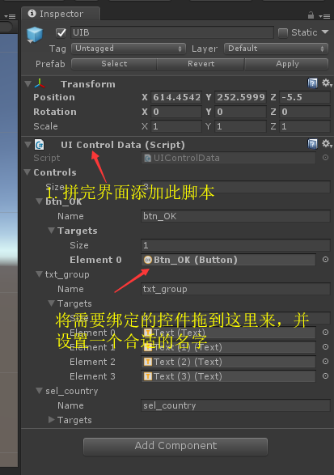
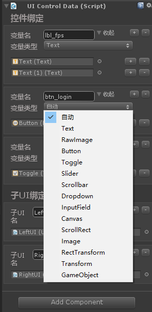
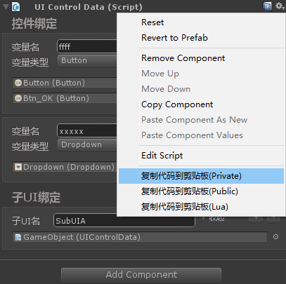

# Unity UIControlBinding
一种半自动控件绑定方案

## 特性
1. 可以实现UI与代码的完全分离, 可以一个 prefab 对应多个逻辑代码，也可以一个逻辑代码使用不同的 prefab（更换UI皮肤或者节日皮肤等）。
2. 界面制作人员只需要一个通用的控件绑定脚本，拖动需要绑定的控件到Inspector面板就可完成可交互控件的绑定工作。
2. 逻辑编写人员可以点击UIControlData组件右上方齿轮图标内的 ``复制代码到剪贴板`` 菜单得到变量声明代码(2,3两个步骤可能都是逻辑编写人员来操作)
3. 允许一个 Prefab 上在不同节点放置多个绑定脚本以便实现变量分组或者UI分区等操作, 此种模式下需要在根脚本绑定子脚本以便运行时可通过名字查找到。

## 操作示意图
### 拼完界面

### 编写逻辑代码时

## 特别感谢
* **flashyiyi**: https://github.com/flashyiyi